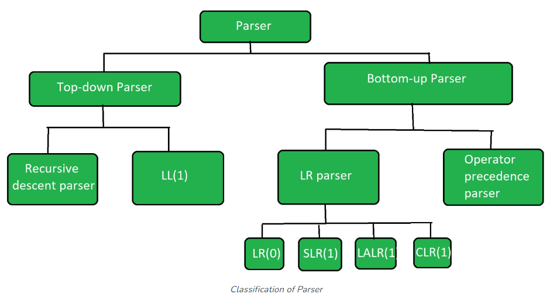
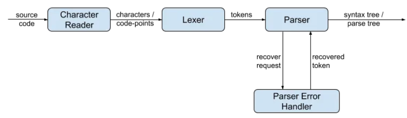
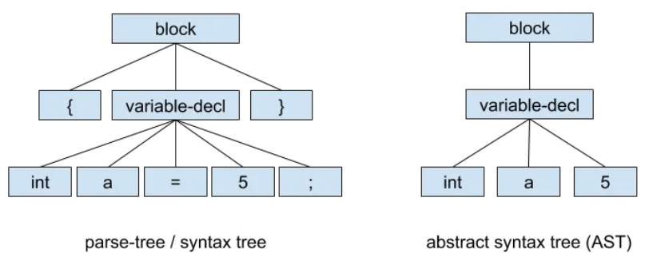

# Topic: Parser & Building an Abstract Syntax Tree
### Course: Formal Languages & Finite Automata
### Author: Maia Zaica

----

## Theory
Parser is a compiler that is used to break the data into smaller elements coming from lexical analysis phase [1].

The parser is that phase of the compiler which takes a token string as input and with the help of existing grammar, converts it into the corresponding Intermediate Representation(IR). The parser is also known as Syntax Analyzer.



Parsing is of two types: *Top-down Parsing* and *Bottom-up Parsing*.

### Top down parsing

* The top-down parsing is known as recursive parsing or predictive parsing.
* Bottom up parsing is used to construct a parse tree for an input string.
* In the top-down parsing, the parsing starts from the start symbol and transform it into the input symbol.

1. **Recursive descent parser** is also known as the Brute force parser or the backtracking parser. It basically generates the parse tree by using brute force and backtracking.
2. **Non-recursive descent parser** is also known as LL(1) parser or predictive parser or without backtracking parser or dynamic parser. It uses a parsing table to generate the parse tree instead of backtracking.

### Bottom up parsing

* Bottom up parsing is also known as shift-reduce parsing.
* Bottom up parsing is used to construct a parse tree for an input string.
* In the bottom up parsing, the parsing starts with the input symbol and construct the parse tree up to the start symbol by tracing out the rightmost derivations of string in reverse.

**LR parser** is the bottom-up parser that generates the parse tree for the given string by using unambiguous grammar. It follows the reverse of the rightmost derivation.

**Operator precedence parser** generates the parse tree from given grammar and string but the only condition is two consecutive non-terminals and epsilon never appears on the right-hand side of any production.

The operator precedence parsing techniques can be applied to Operator grammars.

**Operator grammar**: A grammar is said to be operator grammar if there does not exist any production rule on the right-hand side.
> 1. as ε(Epsilon)
> 2. Two non-terminals appear consecutively, that is, without any terminal between them operator precedence parsing is not a simple               technique to apply to most the language constructs, but it evolves into an easy technique to implement where a suitable grammar             may be produced.

**Components of a parser**



## Objectives
1. Get familiar with parsing, what it is and how it can be programmed [2].
2. Get familiar with the concept of AST [3].
3. In addition to what has been done in the 3rd lab work do the following:
    1. In case you didn't have a type that denotes the possible types of tokens you need to:
        1. Have a type __*TokenType*__ (like an enum) that can be used in the lexical analysis to categorize the tokens.
        2. Please use regular expressions to identify the type of the token.
    2. Implement the necessary data structures for an AST that could be used for the text you have processed in the 3rd lab work.
    3. Implement a simple parser program that could extract the syntactic information from the input text.

## Implementation

Parsing essentially means converting a source-code into a tree-like object representation — which is called the ‘parse tree’ (also sometimes called the ‘syntax tree’). Often, an abstract syntax tree (AST) is confused with a parse/syntax tree. A parse tree is a concrete representation of the source code. It preserves all the information of the source code, including trivial information such as separators, whitespaces, comments, etc. Whereas, an AST is an abstract representation of the source code, and may not contain some of the information that is there in the source.[4]

````java
{
    int a = 5;
}
````


````java
public class Lexer {

    public void nextToken() {
        char nextChar = charReader.peek();
        switch (nextChar) {
            case "\"":
                return processStringLiteral();
            case "0":
            case "1":
            case "2":
            ...
            case "9":
                return processNumericLiteral();
        }
    }
   
}
````
**Emitting a Token**

The lexer plays two sub-roles during the lexing/tokenizing. One is Scanning and the other one is Evaluating. Scanning is the part we discuss in the previous section where the lexer checks/scan the input characters and determine the matching grammar rule. Then depending on the content of the scanned characters, it emits a relevant token. A token not only consist of the character content but also it has a type/kind associated with it. Generally, tokens emitted by a lexer falls on to four major categories:

**Character Reader / Input Reader**

The main purpose of having an abstraction of a character reader is to have a character provider that is independent of the input type. That way, the lexer can simply rely on the `peek()/consume()` methods to provide the characters required to produce tokens.

* **Keywords** — Predefined set of names (identifiers) that are known by the lexer and the parser.
* **Identifiers** — Names whose values are dynamic
* **Literals** — String literals, numeric literals, etc. Values are dynamic.
* **Syntax tokens** — Predefined set of tokens such as separators, arithmetic operators, etc. e.g: { , } , [ , + , — , ( , )

**The Parser**

There are two basic approaches for parsing: *Top-down Parsing* and *Bottom-up Parsing*.

e.g: `AparseExpression()` method may call `parserBinaryExpression()` method, if the currently processing expression is a binary expression (e.g:a+b ). But since both the RHS and the LHS of the binary-expression is again some kind of expression, `parserBinaryExpression()` will call the `parseExpression()` within, creating a recursion. See below for a sample code:

````java
Expression parseExpression() {
   ...
   if (binaryExpr) {
      parseBinaryExpression();
   }
   ...
}
Expression parseBinaryExpression() {
   lhsExpr = parseExpression();
   binaryOp = parseBinaryOp();
   rhsExpr = parseExpression();
   ...
}
````

**Predictive vs Backtracking**

* **Predictive parser**— Look into the tokens ahead in advanced to decide which grammar rule to process
* **Backtracking parser**— Tries to parse an alternative rule. If the parser realizes that the selected grammar rule does not match the input, it goes back (backtracks) to the point where the parsing starts for that rule, starts trying the second alternative rule. Likewise, it tries all the alternatives and proceeds with the best one.
  
Predictive parsers do not try out all the alternative rules, hence they are faster. But on the other hand, backtracking parsers try out all the alternatives, hence tend to yield better results upon syntax errors.


**Grammar requirements**

When implementing the parsing logic for a grammar-rule in an `LL(k)` recursive-descent predictive-parser, the grammar must satisfy the following:

1. Must be non-left recursive

If the grammar rule is left-recursive, it must be re-written in a way such that left-recursion is eliminated. eg:
````
binary-expr := expression binary-operator expression
expression := binary-expr | basic-literal | . . .
````
rewriting the above rule as:
````
binary-expr := terminal-expression binary-operator expression
terminal-expression := basic-literal | var-ref | func-call | . . .
expression := binary-expr | terminal-expression | . . .
````

2. Must be linear

Consider the below grammar rule.
````
function := func-def | func-decl
func-def := functionSig ‘{‘ statements ‘}’
func-decl:= functionSig ‘;’
````
`functionSig` would be traversed twice. This can be avoided by rewriting the grammar rule in such a way that common productions are taken out of the alternative rules. eg:
````
function := functionSig (func-body | ‘;’)
func-body := ‘{‘ statements ‘}’
````
**Syntax Errors**

A syntax error is a case where an unexpected token is reached, or in other words, the next token does not match the defined grammar. In different languages, there can be many different syntax errors.


## Colnclusion

In the laboratory work, we focused on familiarizing ourselves with parsing, the concept of Abstract Syntax Trees (AST), and implementing a simple parser program.

Parsing refers to the process of analyzing a sequence of tokens to determine their syntactic structure and derive meaning from them. It involves breaking down the input into a hierarchical structure that represents the grammar of the language being parsed. This hierarchical structure is typically represented using an Abstract Syntax Tree (AST).

An AST is a tree-like data structure that represents the syntactic structure of a program or expression. Each node in the tree corresponds to a construct in the source code, such as a function call, an if statement, or a variable declaration. The tree's structure reflects the hierarchical relationships between these constructs.

To accomplish the objectives mentioned, we needed a type to denote the possible types of tokens. This type, called TokenType, acts as an enum and helps categorize the tokens during lexical analysis. Regular expressions are then used to identify the type of each token.

We also implemented the necessary data structures for an AST. This involves defining different types of AST nodes, such as ExpressionNode, StatementNode, FunctionNode, etc., depending on the language or grammar being parsed. These nodes store the relevant information and relationships between the constructs in the source code.

Finally, we implemented a simple parser program that extracts the syntactic information from the input text. The parser takes the sequence of tokens produced by the lexer and constructs an AST based on the grammar rules. It traverses the token stream, matches patterns, and builds the corresponding AST nodes. The resulting AST can then be used for various purposes, such as further analysis, code generation, or interpretation.

In conclusion, the laboratory work provided an introduction to parsing, ASTs, and implementing a simple parser program. It helped us understand the role of parsing in analyzing the structure of a program and how ASTs can represent this structure. By using token types, regular expressions, and appropriate data structures, we were able to implement a parser capable of extracting syntactic information from the input text.

## References:
[1]. [Parser Javatpoint](https://www.javatpoint.com/parser)

[2]. [Parsing Wiki](https://en.wikipedia.org/wiki/Parsing)

[3]. [Abstract Syntax Tree Wiki](https://en.wikipedia.org/wiki/Abstract_syntax_tree)

[4]. [Writing a Parser — Part II: Algorithms and Implementation](https://supunsetunga.medium.com/writing-a-parser-algorithms-and-implementation-a7c40f46493d)