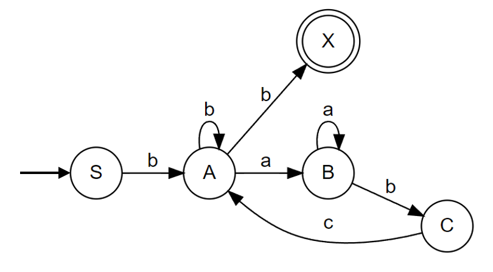

# Topic: Intro to formal languages. Regular grammars. Finite Automata.

### Course: Formal Languages & Finite Automata
### Author: Maia Zaica
### Variant 29

----

## Theory
An **alphabet** is specified by giving a finite set, Σ, whose elements are
called **symbols**. For us, any set qualifies as a possible alphabet, so long
as it is finite.

A **string of length** *n* (≥ 0) over an alphabet Σ is just an ordered *n*-tuple
of elements of Σ, written without punctuation [[1]](#1). 

The **concatenation** of two strings *u, v* ∈ Σ
<sup>*</sup> is the string *uv* obtained by joining the strings end-to-end.

An automaton with a finite number of states is called a **Finite Automaton** (FA) or Finite State Machine (FSM).
Formal definition of a Finite Automaton [[2]](#2).

An automaton can be represented by a 5-tuple (Q, ∑, δ, q<sub>0</sub>, F), where:
* **Q** is a finite set of states
* **∑** is a finite set of symbols, called the alphabet of the automaton.
* **δ** is the transition function.
* **q<sub>0</sub>** is the initial state from where any input is processed (q0 ∈ Q).
* **F** is a set of final state/states of Q (F ⊆ Q).

#### Grammar
Grammar in theory of computation is a finite set of formal rules that are generating syntactically correct sentences [[3]](#3).

The formal definition of grammar is that it is defined as four tuples −

> G = (V<sub>N</sub>, V<sub>T</sub>, P, S)

- V<sub>N</sub> is a finite set of non-terminal symbols;
- V<sub>T</sub> is a finite set of terminal symbols;
- S is a start symbol;
- P is a finite set of productions of rules. 

**Variant 29**
```
Vn = {S, A, B, C},
Vt = {a, b}, 
P = {          
      S → bA     
      A → b    
      A → aB   
      B → bC    
      C → cA
      A → bA
      B → aB }
```
or
```
P = {          
      S → bA     
      A → aB | bA | b  
      B → aB | bC    
      C → cA }
```
Regular Expression
```
RE(FA) = b(b+aa*bc)*b
```
Regular Grammar to FA
```math
$$
\begin{aligned}
G = (V_{N}, V_{T}, P, S) \\
FA = (Q, ∑, δ, q_{0}, F) \\
1. States \\
Q = V_{N} ∪ {X}, X-final state \\
q_{0} = {S} \\
F = {X} \\
2. Alphabet \\
∑ = V_{T} \\
3. Since we have A → b, we add additional state X-final state \\
δ(A, b)={X} \\
\end{aligned}
```
 [4]

#### Chomsky Classification of Grammars

**Type 0**. *Recursively Enumerable Grammar*: no restrictions on
productions
> α → β

**Type 1**. *Context-Sensitive Grammars*: all production are in the
form
> α<sub>1</sub>Aα<sub>2</sub> → α<sub>1</sub>βα<sub>2</sub>

There are:
- left – context-sensitive grammar α<sub>1</sub>A → α<sub>1</sub>β
- right – context-sensitive grammar Aα<sub>2</sub> → βα<sub>2</sub>

**Type 2**. *Context-Free Grammar*: the all productions of grammar
G must be in form
> A → β, where Α ∈ V<sub>N</sub>, β ∈ (V<sub>N</sub> ∪ V<sub>T</sub>)*

**Type 3**. *Regular Grammar*.
Type 3 is most restricted grammar, it has two representations as:
* **Right linear grammar**:
> A → aB \
> A → a
   
where a ∈ V<sub>T</sub> \
&ensp;&ensp;&ensp;&ensp;&ensp;&ensp;A, B ∈ V<sub>N</sub>

* **Left linear grammar**:
> A → Ba \
> A → a
> 
where a ∈ V<sub>T</sub> \
&ensp;&ensp;&ensp;&ensp;&ensp;&ensp;A, B ∈ V<sub>N</sub>

## Objectives:

1. Understand what a language is and what it needs to have in order to be considered a formal one.

2. Provide the initial setup for the evolving project that you will work on during this semester. I said project because usually at lab works, I encourage/impose students to treat all the labs like stages of development of a whole project. Basically you need to do the following:

   a. Create a local && remote repository of a VCS hosting service (let us all use Github to avoid unnecessary headaches);

   b. Choose a programming language, and my suggestion would be to choose one that supports all the main paradigms;

   c. Create a separate folder where you will be keeping the report. This semester I wish I won't see reports alongside source code files, fingers crossed;

3. According to your variant number (by universal convention it is register ID), get the grammar definition and do the following tasks:
   
   a. Implement a type/class for your grammar;

   b. Add one function that would generate 5 valid strings from the language expressed by your given grammar;

   c. Implement some functionality that would convert and object of type Grammar to one of type Finite Automaton;

   d. For the Finite Automaton, please add a method that checks if an input string can be obtained via the state transition from it;

## Implementation

1. Classes to represent the 2 main object which are the grammar and finite automaton.

```java
public class Grammar
{
    private final HashSet<Character> nonTerminalSymbols = new HashSet<>();
    private final HashSet<Character> terminalSymbols = new HashSet<>();
    private final HashMap<Character, ArrayList<String>> productions = new HashMap<>();
    private final char startSymbol;

    public Grammar(char[] Vn, char[] Vt, char[] productionLeft,
                   String[] productionRight, char startSymbol){
        genNonTerminalSymbols(Vn);
        genTerminalSymbols(Vt);
        genProductions(prodLeft, prodRight);
        this.startSymbol = startSymbol;
    }
    // methods
}
```

This is the implementation of the Grammar class in Java, which represents a context-free grammar.

The class has four instance variables:

* `nonTerminalSymbols`: a set that stores all the non-terminal symbols of the grammar.
* `terminalSymbols`: a set that stores all the terminal symbols of the grammar.
* `productions`: a map that stores the productions of the grammar. Each key in the map is a non-terminal symbol, and its value is a list of strings representing the productions of that non-terminal symbol.
* `startSymbol`: the start symbol of the grammar.

&ensp;&ensp;&ensp;The constructor takes as input arrays of characters representing the non-terminal symbols, the terminal symbols, the left-hand side of the productions, the right-hand side of the productions, and the initial state. The method `genNonTerminalSymbols` adds the non-terminal symbols to the `nonTerminalSymbols` set. The method `genTerminalSymbols` adds the terminal symbols to the `terminalSymbols` set. The method `genProductions` adds the productions to the productions map.

&ensp;&ensp;&ensp;The `method generateWords` takes an integer wordsAmount as input and returns an ArrayList of strings representing `wordsAmount` number of strings generated by the grammar. The method uses a stack and a StringBuilder to generate the strings. It starts with the start symbol, pushes it onto the stack, and pops each symbol off the stack until the stack is empty. If the symbol is a non-terminal symbol, the method randomly selects a production for that symbol and pushes the right-hand side of the production onto the stack. If the symbol is a terminal symbol, the method appends the symbol to the StringBuilder. When the stack is empty, the StringBuilder contains the generated string, which is added to the ArrayList.

&ensp;&ensp;&ensp;The method `toFiniteAutomaton` returns a FiniteAutomaton object that represents the grammar as a finite automaton. The method iterates through the productions, and for each production, it adds a transition to the FiniteAutomaton object. If the right-hand side of the production is a single terminal symbol, the method adds a transition from the left-hand side of the production to the final state of the FiniteAutomaton with the terminal symbol as input. If the right-hand side of the production is two symbols, the method adds a transition from the left-hand side of the production to a new state with the first symbol as input, and then adds a transition from that new state to the final state of the FiniteAutomaton with the second symbol as input.

```java
public class FiniteAutomaton {
   private HashSet<Character> possibleStates;
   private HashSet<Character> alphabet;
   private ArrayList<Transition> transitions;
   private char initialState;
   private char finalState;

   public FiniteAutomaton(HashSet<Character> vn, HashSet<Character> vt, char initialState, char finalState) {
      transitions = new ArrayList<>();
      possibleStates = new HashSet<>(vn);
      possibleStates.add(finalState);
      alphabet = new HashSet<>(vt);
      this.initialState = initialState;
      this.finalState = finalState;
   }
   // methods
}
```
This class represents a finite automaton, which is a mathematical model used to recognize patterns within input strings. It has five instance variables:

* `possibleStates`: a HashSet of characters that represents all possible states of the automaton, including the initial and final states.
* `alphabet`: a HashSet of characters that represents the alphabet of the language recognized by the automaton.
* `transitions`: an ArrayList of Transition objects that represents the transitions between states, i.e., how the automaton moves from one state to another for each symbol of the alphabet.
* `initialState`: a char that represents the initial state of the automaton.
* `finalState`: a char that represents the final state of the automaton.
The class has one constructor that takes four parameters:

* `Vn`: a HashSet of characters that represents the set of non-terminal symbols of a context-free grammar.
* `Vt`: a HashSet of characters that represents the set of terminal symbols of a context-free grammar.
* `initialState`: a char that represents the initial state of the automaton.
* `finalState`: a char that represents the final state of the automaton.

The class also has three methods:

* `setTransitions`(Transition transition): a method that adds a Transition object to the transitions list.
* `printTransitions()`: a method that prints all the transitions in the transitions list.
* `wordIsValid(String word)`: a method that checks if a given string is recognized by the automaton. It takes a String parameter word, and iterates over the string, checking each symbol against the transitions in the transitions list. If the automaton reaches the final state after processing the entire string, it returns true; otherwise, it returns false. It also prints a message indicating whether the string is valid or not.

2. In order to show the execution you can implement a client class/type, which is just a "Main" class/type in which you can instantiate the types/classes. Another approach would be to write unit tests if you are familiar with them.

## Implementation description

```json
{
  "firstName": "John",
  "lastName": "Smith",
  "age": 25
}
```

* About 2-3 sentences to explain each piece of the implementation.


* Code snippets from your files.

```
public static void main() 
{

}
```

* If needed, screenshots.


## Conclusions / Screenshots / Results


## References
<a id="1">[1]</a>. COJUHARI Irina, DUCA Ludmila, FIODOROV Ion. *Formal Languages and Finite Automata Guide for practical lessons*. Chișinău: Editura Tehnica-UTM, 2022. p. 5


<a id="2">[2]</a>.  TUTORIALSPOINT. *Automata Theory Introduction* [online]. [accessed 17.02.2023] Available: https://www.tutorialspoint.com/automata_theory/automata_theory_quick_guide.htm

<a id="3">[3]</a>. TUTORIALSPOINT. *Explain the concept of grammar in TOC*. [online] https://www.tutorialspoint.com/explain-the-concept-of-grammar-in-toc

[4]: https://graphviz.org/Gallery/directed/fsm.html


