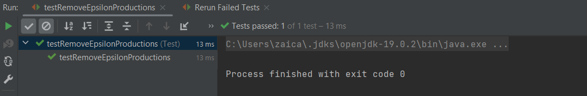

# Topic: Chomsky Normal Form
### Course: Formal Languages & Finite Automata
### Author: Maia Zaica
### Variant 29

----

## Theory
Based on the **Chomsky** classification [[1]](#1).

**Type 2**. *Context-Free Grammar*: the all productions of grammar
G must be in form [[2]](#2).
> A → β, where Α ∈ V<sub>N</sub>, β ∈ (V<sub>N</sub> ∪ V<sub>T</sub>)*

Context-free grammars (CFGs) are used to describe context-free languages. A context-free grammar is a set of recursive rules used to generate patterns of strings. 
A context-free grammar can describe all regular languages and more, but they cannot describe all possible languages.

Context-free grammars are studied in fields of theoretical computer science, compiler design, and linguistics. 
CFG’s are used to describe programming languages and parser programs in compilers can be generated automatically from context-free grammars.

### Chomsky's Normal Form (CNF)

Algorithm to Convert into Chomsky Normal Form [[3]](#3)

**Step 1** − If the start symbol S occurs on some right side, create a new start symbol S’ and a new production S’→ S.

**Step 2** − Remove Null productions. (Using the Null production removal algorithm discussed earlier)

**Step 3** − Remove unit productions. (Using the Unit production removal algorithm discussed earlier)

**Step 4** − Replace each production A → B1…Bn where n > 2 with A → B1C where C → B2 …Bn. Repeat this step for all productions having two or more symbols in the right side.

**Step 5** − If the right side of any production is in the form A → aB where a is a terminal and A, B are non-terminal, then the production is replaced by A → XB and X → a. Repeat this step for every production which is in the form A → aB.


## Objectives

1. Learn about Chomsky Normal Form (CNF) [4].
2. Get familiar with the approaches of normalizing a grammar.
3. Implement a method for normalizing an input grammar by the rules of CNF.
    1. The implementation needs to be encapsulated in a method with an appropriate signature (also ideally in an appropriate class/type).
    2. The implemented functionality needs executed and tested.
    3. A BONUS point will be given for the student who will have unit tests that validate the functionality of the project.
    4. Also, another BONUS point would be given if the student will make the aforementioned function to accept any grammar, not only the one from the student's variant.

## Implementation

### Variant 29

1. Eliminate ε production.
2. Eliminate any renaming
3. Eliminate inaccessible symbols.
4. Eliminate the non-productive symbols.
5. Obtain the Chomsky Normal Form.

G = (V<sub>N</sub>, V<sub>T</sub>, P, S)

V<sub>N</sub> = {S, A, B, C, D}

V<sub>T</sub> = {a,b}
```java
P = {1. S → aB
     2. S → DA
     3. A → a
     4. A → BD
     5. A → aDADB
     6. B → b
     7. B → ASB
     8. D → ε
     9. D → BA
    10. C → BA}
```
```
S->aB|DA
A->a|BD|aDADB
B->b|ASB
D->BA|e
C->BA
```
1. Eliminate start symbol from RHS.

   If start symbol S is at the RHS of any production in the grammar, create a new production as:
   S0->S
   where S0 is the new start symbol.
```
P' = {0. S0 → S
      1. S → aB | DA | A 
      2. A → a | BD | B | aDADB | aADB | aDAB | aAB
      3. B → b | ASB
      4. C → BA
      5. D → BA}
```
2. Eliminate the **ε**-rules.\
   N<sub>ε</sub> = ∅\
for production D → ε:\
N<sub>ε</sub> = ∅ ∪ {D}\
N<sub>ε</sub> = {D}              
```
P' = {0. S0 → S
      1. S → aB | DA | A 
      2. A → a | BD | B | aDADB | aADB | aDAB | aAB
      3. B → b | ASB
      4. C → BA
      5. D → BA}
```
3. Eliminate any renaming (Unit Production).
> A → B\
> A, B ∈ V<sub>N</sub>

The renaming for P' are:\
S → A\
A → B

R<sub>S</sub> = {S}\
R<sub>A</sub> = {A}\
R<sub>B</sub> = {B}\
for S → A:  R<sub>A</sub> = R<sub>S</sub> ∪ R<sub>A</sub> = {S} ∪ {A} = {S, A}\
for A → B:  R<sub>B</sub> = R<sub>B</sub> ∪ R<sub>A</sub> = {S, A} ∪ {B} = {S, A, B}

```
P" = {0. S0 → aB | DA | a | BD | b | ASB | aDADB | aADB | aDAB | aAB
      1. S → aB | DA | a | BD | b | ASB | aDADB | aADB | aDAB | aAB
      2. A → a | BD | b | ASB | aDADB | aADB | aDAB | aAB
      3. B → b | ASB
      4. C → BA
      5. D → BA}
```
4. Eliminate inaccessible symbols.

   I = (V<sub>N</sub> ∪ V<sub>T</sub>) \ Acc\
   I - Inaccessible\
   Acc - Accessible\
   I = ∅

5. Eliminate the non-productive symbols.

   Useless productions – The productions that can never take part in derivation of any string , are called useless productions. 
   Similarly, a variable that can never take part in derivation of any string is called a useless variable.

   Unprod(G) = V<sub>N</sub> \ Prod(G)\
Unprod(G) = {S, A, B, C, D} \ {S, A, B, D} = {C}
```
P''' = {0. S0 → aB | DA | a | BD | b | ASB | aDADB | aADB | aDAB | aAB
        1. S → aB | DA | a | BD | b | ASB | aDADB | aADB | aDAB | aAB
        2. A → a | BD | b | ASB | aDADB | aADB | aDAB | aAB
        3. B → b | ASB
        4. D → BA}
```
6. Obtain the Chomsky Normal Form.
```
Pf = {S0 ⟶ X0B | a | b | X2B | BD | X4B | X3B | X6B | X7B | DA
      S ⟶ X0B | a | b | X2B | BD | X4B | X3B | X6B | X7B | DA
      X0 ⟶ a
      X1 ⟶ b
      X2 ⟶ AS
      X3 ⟶ X0A
      X4 ⟶ X3D
      X5 ⟶ X0D
      X6 ⟶ X5A
      X7 ⟶ X6D
      A ⟶ a | b | X2B | BD | X4B | X3B | X6B | X7B
      B ⟶ b | X2B
      D ⟶ BA}
```
````java
public static void removeEpsilonProductions() {
        Set<String> emptyProductions = new HashSet<>();

        // Find all empty productions and remove them from the original productions
        for (String left : grammar.getProductions().keySet()) {
            List<String> productions = grammar.getProductions().get(left);
            if (productions.remove("")) {
                emptyProductions.add(left);
            }
        }

        // Find all non-terminal symbols with at least one occurrence of an empty production
        // code
        
        // Replace all occurrences of empty productions with all possible combinations of non-empty productions
        // code
    }
````
This method removes epsilon productions from a given grammar. It first finds all empty productions by iterating over the productions of the grammar and removing empty productions from each. Then it identifies all non-terminal symbols that have at least one empty production. Finally, it replaces all occurrences of empty productions with all possible combinations of non-empty productions.


For each step we have methods: `removeUnitProduction`, `removeInaccessibleProduction` and so on.
We get this Constructor having as parameter the grammar we are given.

````java
    public static Grammar getCopyModGrammar(Grammar gr){
        grammar = new Grammar(gr);
        removeEpsilonProductions();
        removeUnitProductions();
        removeInaccessibleProduction();
        convertToChomskyNormalForm();
        return grammar;
    }
````

## Conlcusion 

In this laboratory work, we learned how to transform a context-free grammar (CFG) into Chomsky Normal Form (CNF) by applying a set of well-defined rules. This transformation allowed us to simplify the grammar and make it easier to parse using certain algorithms, such as the CYK algorithm.

The process of transforming a CFG into CNF involved several steps, including removing epsilon productions, unit productions, and non-terminal symbols with unreachable productions. We then had to convert all remaining productions into either productions of the form A -> BC or A -> a, where A, B, and C are non-terminal symbols, and a is a terminal symbol.

Implementing these transformations in code was not always straightforward, as some steps required careful handling of edge cases and special conditions. However, by following the rules systematically and testing each step thoroughly, we were able to successfully transform CFGs into CNF.

Unit tests were an essential tool in this process, as they allowed us to verify the correctness of our code and catch any errors early on. We were able to test each transformation step individually, as well as the overall transformation process, ensuring that our code was robust and reliable.

Overall, this laboratory work provided us with valuable experience in working with context-free grammars and applying transformations to simplify them. It also allowed us to practice implementing these transformations in code and using unit tests to ensure correctness

> Output 

````
Lab4: Chomsky Normal Form.
Context Free Grammar: 
A ⟶ a | B | BD | aADB | aAB | aDAB | aDADB
B ⟶ b | ASB
S ⟶ aB | A | DA
C ⟶ BA
D ⟶ BA


Chomsky Normal Form: 
S ⟶ X0B | a | b | X2B | BD | X4B | X3B | X6B | X7B | DA
X0 ⟶ a
X1 ⟶ b
X2 ⟶ AS
X3 ⟶ X0A
X4 ⟶ X3D
X5 ⟶ X0D
X6 ⟶ X5A
X7 ⟶ X6D
A ⟶ a | b | X2B | BD | X4B | X3B | X6B | X7B
D ⟶ BA
````

Unit Test Result




## References:

<a id="1">[1]</a>. https://drive.google.com/file/d/19muyiabGeGaoNDK-7PeuzYYDe6_c0e-t/view

<a id="3">[2]</a>. https://brilliant.org/wiki/context-free-grammars/#:~:text=A%20context%2Dfree%20grammar%20is,%2C%20compiler%20design%2C%20and%20linguistics.

<a id="3">[3]</a>. https://www.tutorialspoint.com/automata_theory/chomsky_normal_form.htm

[4]: (https://en.wikipedia.org/wiki/Chomsky_normal_form)