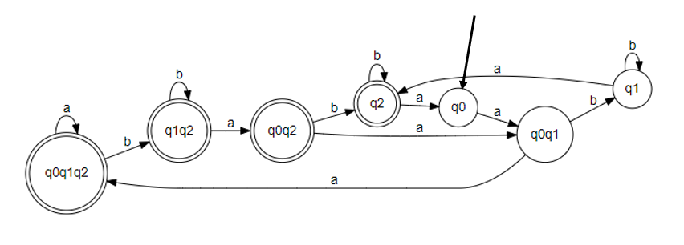
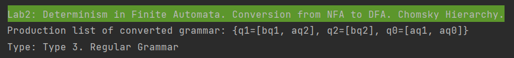

# Topic: Determinism in Finite Automata. Conversion from NFA to DFA. Chomsky Hierarchy.

### Course: Formal Languages & Finite Automata
### Author: Maia Zaica
### Variant 29

----
## Theory

### Determinism in Finite Automata.
**Non-Deterministic Finite Automata** (NDFA / NFA) is an automata in which
for some current state and input symbol, there exists more than one next output states [[1]](#1).

It is also known as Non-Deterministic Finite Accepter (NFA).

**Deterministic Finite Automata** (or DFA) are finite state machines that accept or reject strings of characters by parsing them through a sequence that is uniquely determined by each string.

The term “deterministic” refers to the fact that each string, and thus each state sequence, is unique.
In a DFA, a string of symbols is parsed through a DFA automata, and each input symbol will move to the next state that can be determined [[2]](#2).

### Conversion from NFA to DFA.

Non-Deterministic Finite Automata is defined by the quintuple -
(Q, ∑, δ, q<sub>0</sub>, F), where:
* **Q** is a finite set of states
* **∑** is a finite set of symbols, called the alphabet of the automaton.
* **δ** is the transition function.
* **q<sub>0</sub>** is the initial state from where any input is processed (q0 ∈ Q).
* **F** is a set of final state/states of Q (F ⊆ Q).

Converted to a DFA (Q', ∑, δ', q<sub>0</sub>, F'),
where:
* **Q'** is the new finite set of states
* **∑** is a finite set of symbols, called the alphabet of the automaton. Input symbols
* **δ'** is the transition function.
* **q<sub>0</sub>** is the initial state from where any input is processed (q0 ∈ Q').
* **F** is the new set of final state/states.

> **Note**: While converting an NFA with n states to a DFA, 2n possible set of states can be reachable but not necessarily reached in the DFA.


Steps for converting NFA to DFA [[3]](#3):

**Step 1**: Initially Q' = ∅

**Step 2**: Add q<sub>0</sub> of NFA to Q'. Then find the transitions from this start state.

**Step 3**: In Q', find the possible set of states for each input symbol. If this set of states is not in Q', then add it to Q'.

**Step 4**: In DFA, the final state will be all the states which contain F(final states of NFA).

### Chomsky Hierarchy [[4]](#4).

**Type 0**. *Recursively Enumerable Grammar*: no restrictions on
productions
> α → β

**Type 1**. *Context-Sensitive Grammars*: all production are in the
form
> α<sub>1</sub>Aα<sub>2</sub> → α<sub>1</sub>βα<sub>2</sub>

There are:
- left – context-sensitive grammar α<sub>1</sub>A → α<sub>1</sub>β
- right – context-sensitive grammar Aα<sub>2</sub> → βα<sub>2</sub>

**Type 2**. *Context-Free Grammar*: the all productions of grammar
G must be in form
> A → β, where Α ∈ V<sub>N</sub>, β ∈ (V<sub>N</sub> ∪ V<sub>T</sub>)*

**Type 3**. *Regular Grammar*.
Type 3 is most restricted grammar, it has two representations as:
* **Right linear grammar**:
> A → aB \
> A → a

where a ∈ V<sub>T</sub> \
&ensp;&ensp;&ensp;&ensp;&ensp;&ensp;A, B ∈ V<sub>N</sub>

* **Left linear grammar**:
> A → Ba \
> A → a

where a ∈ V<sub>T</sub> \
&ensp;&ensp;&ensp;&ensp;&ensp;&ensp;A, B ∈ V<sub>N</sub>

## Objectives:

1. Understand what an automaton is and what it can be used for.

2. Continuing the work in the same repository and the same project, the following need to be added:
   a. Provide a function in your grammar type/class that could classify the grammar based on Chomsky hierarchy.

   b. For this you can use the variant from the previous lab.

3. According to your variant number (by universal convention it is register ID), get the finite automaton definition and do the following tasks:

   a. Implement conversion of a finite automaton to a regular grammar.

   b. Determine whether your FA is deterministic or non-deterministic.

   c. Implement some functionality that would convert an NDFA to a DFA.

   d. Represent the finite automaton graphically (Optional, and can be considered as a __*bonus point*__):

  - You can use external libraries, tools or APIs to generate the figures/diagrams.

  - Your program needs to gather and send the data about the automaton and the lib/tool/API return the visual representation.


## Implementation

Variant 29:
```
Q = {q0,q1,q2},
∑ = {a,b},
F = {q2},
δ(q0,a) = q1,
δ(q0,a) = q0,
δ(q1,b) = q1,
δ(q1,a) = q2,
δ(q2,b) = q2,
δ(q2,a) = q0.
```


**Figure. 1** *NFA*


Transition table

NFA = (Q, ∑, δ, q<sub>0</sub>, F)

|  δ  |   a  | b  |
|:---:|:----:|----|
| →q0 | q0q1 | ∅  |
| q1  | q2   | q1 |
| *q2 | q0   | q2 |

DFA = (Q', ∑, δ', q<sub>0</sub>, F')

|    δ'     |     a    | b      |
|:---------:|:--------:|--------|
|    →q0    | {q0q1}   | ∅      |
|  {q0q1}   | {q0q1q2} | q1     |
|    q1     | q2       | q1     |
| *{q0q1q2} | {q0q1q2} | {q1q2} |
|    *q2    | q0       | q2     |
|  *{q1q2}  | {q0q2}   | {q1q2} |
|  *{q0q2}  | {q0q1}   | q2     |



**Figure. 1** *DFA*

## Implementation

```java
public void grammarType(){
boolean isRegular = true;
boolean isContextFree = true;

        for(String key : productions.keySet()){
            if (key.length() > 1 && !nonTerminalSymbols.contains(key)) {
                isContextFree = false;
                isRegular = false;
                break;
            }
        }

        for(ArrayList<String> list : productions.values()){
            for(String element : list){
                if(element.length() == 0){
                    System.out.println("Type: Type 0. Recursively Enumerable Grammar");
                    return;
                }
                boolean isTwoSymbol = nonTerminalSymbols.contains(element.substring(1));
                if(element.length() > 2 && !isTwoSymbol){
                    isRegular = false;
                }

                else if(element.length() == 2 || isTwoSymbol){
                    String first = String.valueOf(element.charAt(0));
                    String second = element.substring(1);
                    if(!terminalSymbols.contains(first) || !nonTerminalSymbols.contains(second)){
                        isRegular = false;
                    }
                } else {
                    String symbol = String.valueOf(element.charAt(0));
                    if(!terminalSymbols.contains(symbol)){
                        isRegular = false;
                    }
                }
            }
        }

        if(isRegular){
            System.out.println("Type: Type 3. Regular Grammar");
        } else if(isContextFree){
            System.out.println("Type:Type 2. Context-free Grammar");
        } else {
            System.out.println("Type: Type 1. Context-Sensitive Grammar");
        }
    }
```
The method above determines the grammar type based on Chomsky Hierarchy

```java
public void isNFA(){
        Grammar grammar = this.toGrammar();
        HashMap<String, ArrayList<String>> production = grammar.getProductions();

        boolean isNFA = false;
        for(ArrayList<String> states : production.values()){
            for(int i=0; i<alphabet.size(); i++){
                HashSet<String> transitions = new HashSet<>();
                for(String state : states){
                    String[] transitionsForSymbol = state.split(",");
                    if(transitionsForSymbol.length > 1){
                        isNFA = true;
                        break;
                    }
                    transitions.add(transitionsForSymbol[i]);
                }
                if(transitions.size() > 1){
                    isNFA = true;
                    break;
                }
            }
            if(isNFA){
                System.out.println("Type: Non-deterministic Finite Automaton");
                return;
            }
        }
        System.out.println("Type: Deterministic Finite Automaton");
    }
```
The given code is a method that determines the type of a given grammar based on Chomsky's hierarchy. Chomsky's hierarchy is a classification of grammars into four types based on the type of rules that they use. The four types of grammars are:

* **Type 0** - Unrestricted or Recursively Enumerable Grammar
* **Type 1** - Context-sensitive Grammar
* **Type 2** - Context-free Grammar
* **Type 3** - Regular Grammar

The given code determines the type of the grammar by analyzing the productions of the grammar. It uses the following criteria to determine the type of the grammar:

If any production has a non-terminal symbol of length greater than 1, then the grammar is not context-free and not regular. It is a recursively enumerable grammar.
If all productions have at most one non-terminal symbol on the right-hand side, then the grammar is regular. Otherwise, it is not regular.
If all productions have at most one non-terminal symbol on the left-hand side, then the grammar is context-free. Otherwise, it is context-sensitive.
Based on these criteria, the code sets the boolean variables isRegular and isContextFree to true or false, and then prints out the type of the grammar.

Note that the code assumes that the grammar is given as a map productions where the keys are the left-hand sides of the productions and the values are lists of the right-hand sides of the productions. 

## Conclusions / Screenshots / Results
Before executing the laboratory work we had to get familiar with the concepts of Determinism in Finite Automata. Conversion from NFA to DFA. Chomsky Hierarchy. 
Executing this laboratory work we had to further develop the project we began in Lab1. From hard coding we try to implement for general cases.




## References
<a id="1">[1]</a>. AKSHAY, Singhal. *Non Deterministic Finite Automata | NFA*. Gate Vidyalay. Available:
https://www.gatevidyalay.com/non-deterministic-finite-automata-nfa/

<a id="2">[2]</a>. SISENSE. *What is Deterministic Finite Automata?*. [online]. Available: 
https://www.sisense.com/glossary/deterministic-finite-automata/

<a id="3">[3]</a>. GEEKSFORGEEKS. *Conversion from NFA to DFA*. 25 Feb. 2021. Available: 
https://www.geeksforgeeks.org/conversion-from-nfa-to-dfa/

<a id="4">[4]</a>. COJUHARI Irina, DUCA Ludmila, FIODOROV Ion. *Formal Languages and Finite Automata Guide for practical lessons*. Chișinău: Editura Tehnica-UTM, 2022. p. 5
