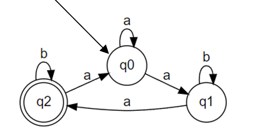

# Topic: Determinism in Finite Automata. Conversion from NFA to DFA. Chomsky Hierarchy.

### Course: Formal Languages & Finite Automata
### Author: Maia Zaica
### Variant 29

----
## Theory
If needed, but it should be written by the author in her/his words.


## Objectives:

* First objective.
* ...

**Figure. 1**

## Implementation description

Variant 29:
```
Q = {q0,q1,q2},
∑ = {a,b},
F = {q2},
δ(q0,a) = q1,
δ(q0,a) = q0,
δ(q1,b) = q1,
δ(q1,a) = q2,
δ(q2,b) = q2,
δ(q2,a) = q0.
```
* About 2-3 sentences to explain each piece of the implementation.


* Code snippets from your files.

```
public static void main() 
{

}
```

* If needed, screenshots.


## Conclusions / Screenshots / Results

Here is a simple footnote[^1].

A footnote can also have multiple lines[^2].

You can also use words, to fit your writing style more closely[^note].

[^1]: My reference.
[^2]: Every new line should be prefixed with 2 spaces.  
This allows you to have a footnote with multiple lines.
[^note]:
Named footnotes will still render with numbers instead of the text but allow easier identification and linking.  
This footnote also has been made with a different syntax using 4 spaces for new lines.
## References