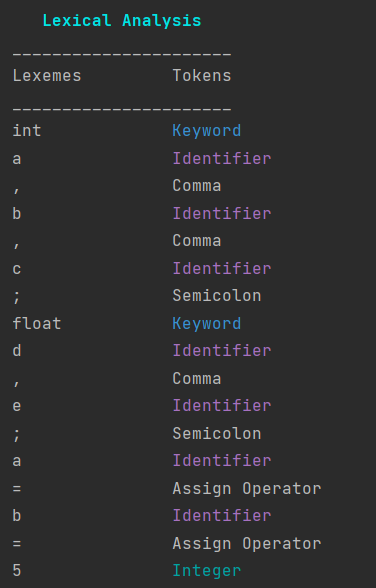

# Topic: Lexer | Scanner
### Course: Formal Languages & Finite Automata
### Author: Maia Zaica

----

## Theory

&ensp;&ensp;&ensp;**Lexical analysis** or **scanning** is the process where the stream of characters making up
the source program is read from left to right and grouped into tokens [[1]](#1).

&ensp;&ensp;&ensp;**Tokens** are sequences of characters with a collective meaning.

&ensp;&ensp;&ensp;There are usually only a small number of tokens for a programming language: constants (integer, double, char, string,
etc.) operators (arithmetic, relational, logical), punctuation, and reserved words.

#### Notes on Lexical Analysis
* The **lexical analyzer** takes a source program as input, and produces a stream of tokens as output.
* Lexical analyzer might recognize particular
  instances of tokens, such specific instances are
  called lexemes.
* A lexeme is the actual character sequence
  forming a token, the token is the general class
  that a lexeme belongs to.

There are two primary **methods** for implementing a scanner.
* The first is a program that is hard coded to perform the scanning tasks. 
  1. Scanner implementation: loop & switch (used this one)
* The second is the use of regular expressions and finite automata to model the scanning process.
  2. Scanner implementation: regular expressions & finite automata.

Implementing Lexical Analyzers [[2]](#2)
Different approaches:
> * Using a scanner generator, e.g., `lex` or `flex`. This automatically
generates a lexical analyzer from a high-level description of the tokens.\
(*easiest to implement; least efficient*)
> * Programming it in a language such as C, using the I/O facilities of the language.\
(*intermediate in ease, efficiency*)
> * Writing it in assembly language and explicitly managing the input.\
(*hardest to implement, but most efficient*)


**Lexical Analysis**: Terminology
> **token**: a name for a set of input strings with related
structure.

*Example*: `“identifier,” “integer constant”`
> **pattern**: a rule describing the set of strings
associated with a token.

*Example*: `“a letter followed by zero or more letters, digits, or
underscores.”`
> **lexeme**: the actual input string that matches a
pattern.

*Example*: `count`

#### Finite Automata and Lexical Analysis
* The tokens of a language are specified using regular expressions.
* A scanner is a big DFA, essentially the “aggregate” of the automata for the individual tokens.
* Issues: \
  &ensp;&ensp;&ensp;What does the scanner automaton look like? \
  &ensp;&ensp;&ensp;How much should we match? (When do we stop?) \
  &ensp;&ensp;&ensp;What do we do when a match is found? \
  &ensp;&ensp;&ensp;Buffer management (for efficiency reasons).

## Objectives
1. Understand what lexical analysis.
2. Get familiar with the inner workings of a lexer/scanner/tokenizer.
3. Implement a sample lexer and show how it works.


## Implementation

### Types of Tokens

Starting with what kind of **tokens** there can be:

Tokens includes the following [[3]](#3):
* Keywords
* Identifiers
* Literals
* Operators
* Separators
* Comments


| Operator   | Symbols                                    |
|------------|--------------------------------------------|
| Arithmetic | + , - , / , * , %                          |
| Unary      | ++ , - - , !                               |
| Assignment | = , += , -= , *= , /= , %= , ^=            |
| Relational | ==, != , < , >, <= , >=                    |
| Logical    | && , \|\|                                  |
| Ternary    | (Condition) ? (Statement1) : (Statement2); |
| Bitwise    | & , \| , ^ , ~                             |
| Shift      | << , >> , >>>                              |

**Keywords**: These are the pre-defined reserved words of any programming language. 
Each keyword has a special meaning. It is always written in lower case. 
For example Java provides the following keywords: `abstract, boolean, byte, break, class,
case, catch, char, continue, default, do, double, else, extends, final, float, for, if, implements , import,
instanceof, int, interface, long, native, new, package, private, protected, public, return, short, static, super
switch, synchronized, this, throws, transient, try, void, volatile, while, assert, const, enum, goto, strictfp`

**Identifier**: Identifiers are used to name a variable, constant, function, class, and array. It usually defined by the user. It uses letters, underscores, or a dollar sign as the first character. The label is also known as a special kind of identifier that is used in the goto statement. Remember that the identifier name must be different from the reserved keywords. There are some rules to declare identifiers are:

* The first letter of an identifier must be a letter, underscore or a dollar sign. It cannot start with digits but may contain digits.
* The whitespace cannot be included in the identifier.
* Identifiers are case sensitive.

**Literals**: In programming literal is a notation that represents a fixed value (constant) in the source code. It can be categorized as an integer literal, string literal, Boolean literal, etc. It is defined by the programmer. Once it has been defined cannot be changed. Java provides five types of literals are as follows:

* Integer
* Floating Point
* Character
* String
* Boolean

| Literal       | Type               |
|---------------|--------------------|
| 3             | int                |
| 29.09         | double             |
| false, true   | boolean            |
| 'K', '7', '-' | char               |
| "aaaah"       | String             |
| null          | any reference type |

**Operators**: In programming, operators are the special symbol that tells the compiler to perform a special operation. Different types of operators that can be classified according to the functionality they provide. Types of operators:

* Arithmetic Operators
* Assignment Operators
* Relational Operators 
* Unary Operators 
* Logical Operators 
* Ternary Operators 
* Bitwise Operators 
* Shift Operators

| Operator   | Symbols                                    |
|------------|--------------------------------------------|
| Arithmetic | + , - , / , * , %                          |
| Unary      | ++ , - - , !                               |
| Assignment | = , += , -= , *= , /= , %= , ^=            |
| Relational | ==, != , < , >, <= , >=                    |
| Logical    | && , \|\|                                  |
| Ternary    | (Condition) ? (Statement1) : (Statement2); |
| Bitwise    | & , \| , ^ , ~                             |
| Shift      | << , >> , >>>                              |

**Separators**: The separators in Java is also known as punctuators. There are nine separators in Java, are as follows:

`separator <= ; | , | . | ( | ) | { | } | [ | ]`

`Square Brackets []`: It is used to define array elements. A pair of square brackets represents the single-dimensional array,
two pairs of square brackets represent the two-dimensional array.


`Parentheses ()`: It is used to call the functions and parsing the parameters.

`Curly Braces {}`: The curly braces denote the starting and ending of a code block.

`Comma (,)`: It is used to separate two values, statements, and parameters.

`Assignment Operator (=)`: It is used to assign a variable and constant.

`Semicolon (;)`: It is the symbol that can be found at end of the statements. It separates the two statements.

`Period (.)`: It separates the package name form the sub-packages and class. It also separates a variable or method from a reference variable.

**Comments**: Comments allow us to specify information about the program inside our code. Compiler recognizes these comments as tokens but excludes it form further processing. The compiler treats comments as whitespaces. Java provides the following two types of comments:

* **Line Oriented**: It begins with a pair of forwarding slashes `//`.
* **Block-Oriented**: It begins with `/*` and continues until it founds `*/`.

When creating a lexer, one approach to analyzing each token is to use hard-coded logic to identify each token type. 
This involves writing a series of if-else statements or switch-case statements to check the input string and identify the appropriate token type.

For example, if we want to create a lexer that can identify integer literals, we might use the following hard-coded logic:
```java
public Token getNextToken(String input) {
    int i = 0;
    while (i < input.length()) {
        char ch = input.charAt(i);

        if (Character.isDigit(ch)) {
            String value = "";
            while (i < input.length() && Character.isDigit(input.charAt(i))) {
                value += input.charAt(i++);
            }
            return new Token(TokenType.INTEGER, value);
        }
        i++;
    }
    return new Token(TokenType.EOF, "");
}
```
I have the Main method and two classes: `LexerClass` and `Token`.

```java
public class Token {
    String token;
    String lexeme;

    public Token(String token, String lexeme) {
        this.token = token;
        this.lexeme = lexeme;
    }
    public String toString() {
        return formatOutPut(lexeme, token);
    }
    String formatOutPut(String l,String t){
        return l + " ".repeat(Math.max(0, 16 - l.length())) + token;
    }
}
```
This code defines a class called Token that has two instance variables, `token` and `lexeme`, both of type `String`. The class also has a constructor that takes in two arguments, `token` and `lexeme`, and initializes the instance variables with these values.

The class also has a method called `toString`, which overrides the default `toString` method inherited from the Object class. This method returns a formatted string that combines the lexeme and token values of the Token instance. The `formatOutPut` method is a helper method used by `toString` to format the output string by adding whitespace to the end of the lexeme string to ensure that the token string is properly aligned.

Overall, this class is used to represent a token, which is a fundamental unit of syntax in programming languages. The `token` variable represents the type of the token (e.g. keyword, identifier, operator, etc.) and the `lexeme` variable represents the actual value of the token (e.g. the name of a variable or the value of a number).

````java
public class LexerClass {
    
}
````
The `LexerClass`, is a program that reads in a sequence of characters and converts it into a sequence of tokens, 
which can be further processed.

The `LexerClass` has a constructor that takes in a `File` object and initializes a `BufferedReader` object with the contents of the file.
The `generateTokens` method reads the input stream character by character and generates a list of Token objects. The `readNextToken` method is responsible for reading the next token in the input stream.
````java
    public LexerClass(File file) {
        try {
            reader = new BufferedReader(new FileReader(file));
        } catch (FileNotFoundException e) {
            e.printStackTrace();
        }
        current = readNextChar();
    }
````
The `readNextToken` method uses a switch statement to check the current state of the lexer. In state 1, it checks for various characters and returns the appropriate token if a match is found. If the character is a letter or underscore, it moves to state 2 to parse an identifier or keyword. If the character is a number, it also moves to state 2 to parse a decimal or integer.

In state 2, the lexer reads characters until it reaches the end of the identifier or keyword. If the sequence of characters is a keyword, it returns a Token object with the type "Keyword" and the value of the keyword. If it is an identifier, it returns a Token object with the type "Identifier" and the value of the identifier. If it is a number, it returns a Token object with the type "Integer" or "Decimal" and the value of the number.
````java
     public Token readNextToken() {
        int state = 1;
        while (true) {
            // code while true
            }
            switch (state) {
                case 1 -> {
                    if (current == ' ' || current == '\n' || current == '\t' ||
                            current == '\f' || current == '\b' || current == '\r') {
                        current = readNextChar();
                    } 
                    // if else statemets
                    } else {
                        state = 2;
                    }
                }
                case 2 -> {
                    {
                        if (isNumber(current)) {
                            // code executed if true
                    }{
                        if (isLetter(current) || current == '_') {
                            // code executed if true
                        } else {
                            // code executed if fasle
                        }
                    }
                }
                default -> throw new IllegalStateException("Unexpected value: " + state);
            }
        }
    }
    
````
As Test, we analyze a simple code with simple syntax, it has int, float type of variables, there is also the if-else statement used
````java
File file = new File("C:\\Users\\zaica\\IdeaProjects\\FLFA_Labs\\src\\Lexer\\input.txt");
````
This program demonstrates a basic implementation of a lexer (lexical analyzer) for a given input file. It reads from an input file named "input.txt" and generates tokens for each lexeme (basic unit of syntax) encountered in the file.
A list of Token objects is generated. Then iterates through the list and prints each token to the console using the token's toString method.

If an exception is thrown during the process, the program prints the exception stack trace to the console.
````java
try {
    file = new File("C:\\Users\\zaica\\IdeaProjects\\FLFA_Labs\\src\\Lexer\\input.txt");
    LexerClass lexerClass = new LexerClass(file);
    List<Token> tokenList = lexerClass.generateTokens();
    for (Token token : tokenList) {
        out.println(token.toString());
    }
} catch (Exception e){
            e.printStackTrace();
}
````
## Conclusion
Executing the laboratory work helped in understanding better lexical analysis and how it is implemented in practice.

Through the implementation of a sample lexer, we have learned how to convert a stream of characters into a sequence of tokens, where each token represents a meaningful unit of code.

The lexer implementation has demonstrated the process of recognizing lexical units such as keywords, identifiers, literals, and operators in a given source code file. It has also shown how to handle whitespace, comments, and other irrelevant characters, by skipping them and focusing only on the relevant ones.

By using the sample lexer implementation to analyze a sample source code file, we have been able to see how the lexer can effectively break down a program into a series of tokens, which can then be used by other components of a compiler or interpreter to analyze, parse, and execute the program.



Output
````
Lexical Analysis
______________________
Lexemes         Tokens
______________________
int             Keyword
a               Identifier
,               Comma
b               Identifier
,               Comma
c               Identifier
;               Semicolon
float           Keyword
d               Identifier
,               Comma
e               Identifier
;               Semicolon
a               Identifier
=               Assign Operator
b               Identifier
=               Assign Operator
5               Integer
;               Semicolon
c               Identifier
=               Assign Operator
6               Integer
;               Semicolon
if              Keyword
(               Left Parenthesis
a               Identifier
Not Defined     Error
b               Identifier
)               Right Parenthesis
{               Left Bracket
c               Identifier
=               Assign Operator
a               Identifier
*               Multiplication Operator
b               Identifier
;               Semicolon
e               Identifier
=               Assign Operator
d               Identifier
-               Minus Operator
2.0             Decimal
;               Semicolon
}               Right Bracket
else            Keyword
{               Left Bracket
d               Identifier
=               Assign Operator
e               Identifier
+               Plus Operator
6.0             Decimal
;               Semicolon
b               Identifier
=               Assign Operator
a               Identifier
+               Plus Operator
c               Identifier
;               Semicolon
}               Right Bracket
````
## References
<a id="1">[1]</a>. SAUMY, Debray. *Lexical Analysis (Scanning)*. The University of Arizona Tucson. Available:
https://hama-univ.edu.sy/newsites/technology/wp-content/uploads/2018/10/%D8%A7%D9%84%D9%82%D8%B3%D9%85-%D8%A7%D9%84%D8%AB%D8%A7%D9%84%D8%AB.pdf

<a id="2">[2]</a>. COJUHARI Irina, DUCA Ludmila, FIODOROV Ion. *Formal Languages and Finite Automata Guide for practical lessons*. Chișinău: Editura Tehnica-UTM, 2022. p. 5

<a id="3">[3]</a>. JAVATPOINT. *Java Tokens*. [online]. [accessed 29.03.2023]. Available:
https://www.javatpoint.com/java-tokens#:~:text=In%20the%20above%20code%20snippet,are%20the%20Java%20tokens.

<a id="4">[4]</a>. Saumya Debray The University of Arizona Tucson. *Lexical Analysis(Scanning)*. Available:
https://www2.cs.arizona.edu/classes/cs453/fall10/LectureMaterials/NOTES/PDF/LexicalAnalysis.pdf